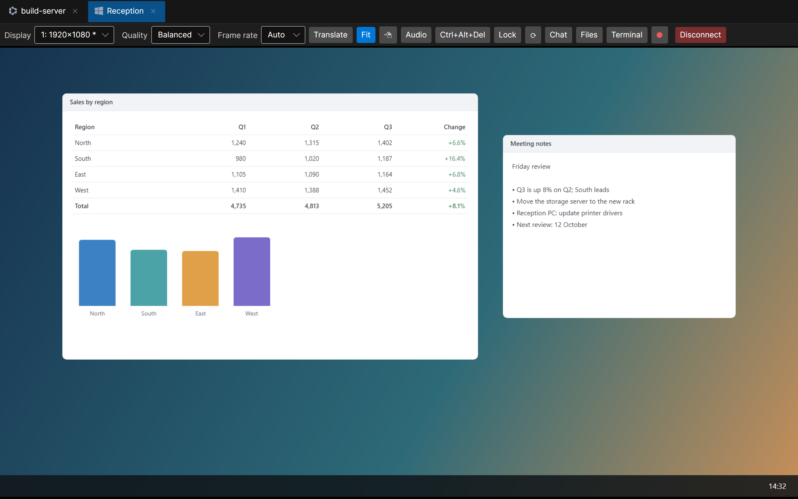
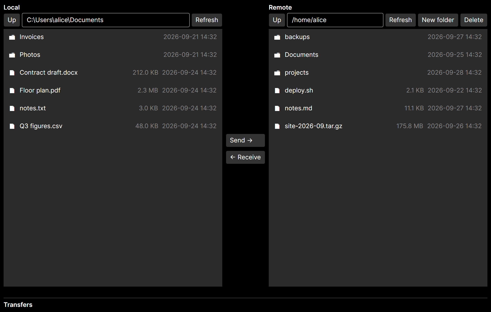
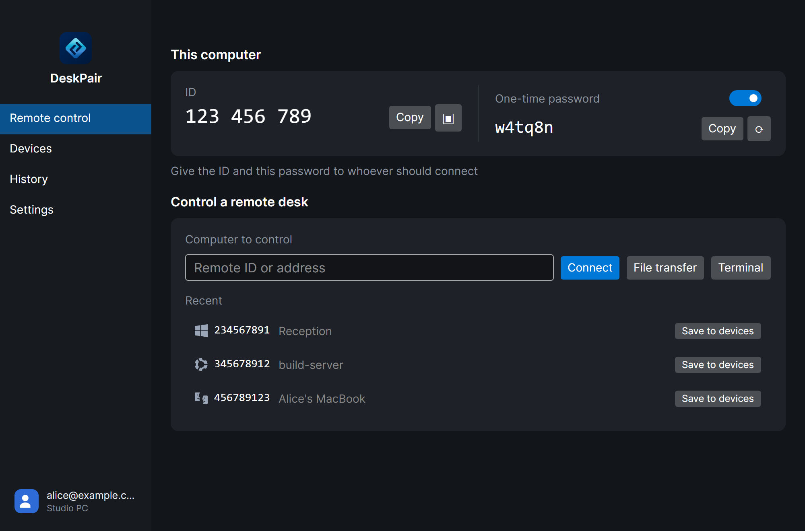
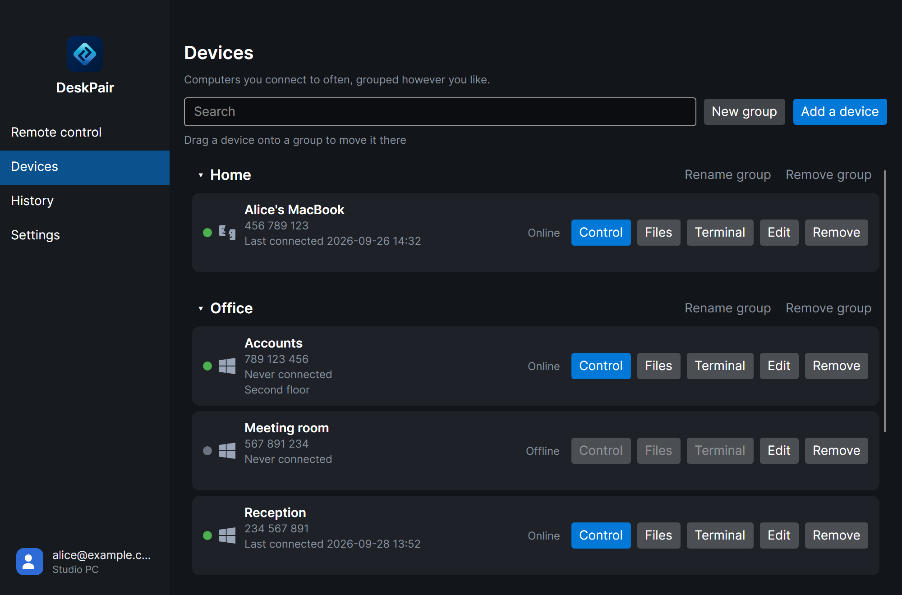
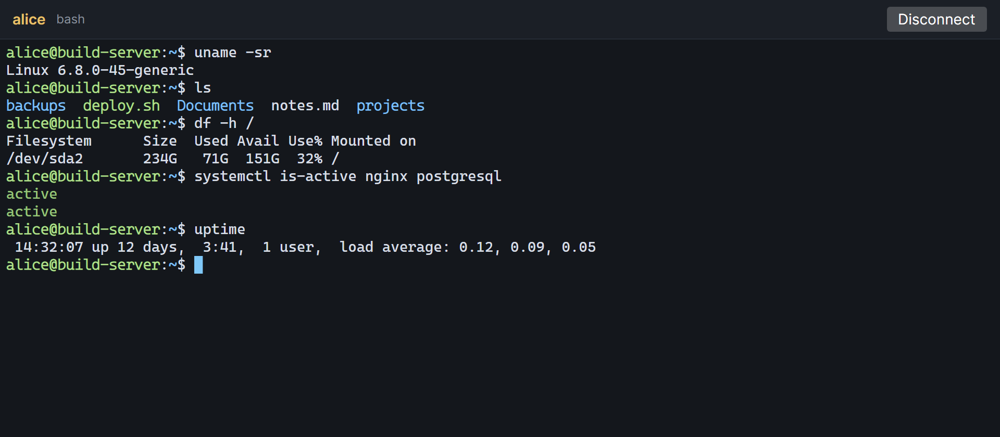
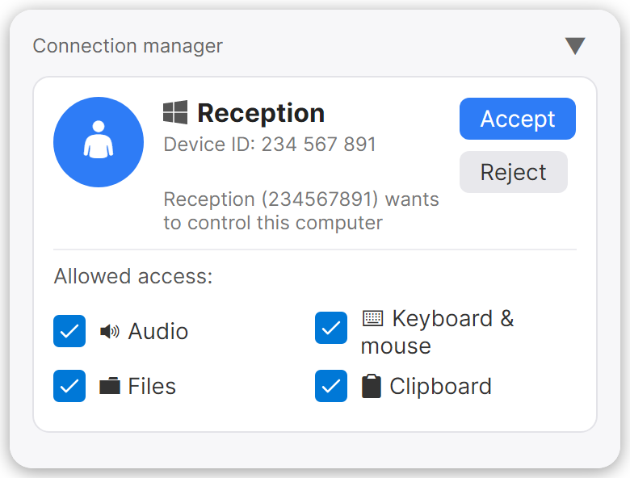
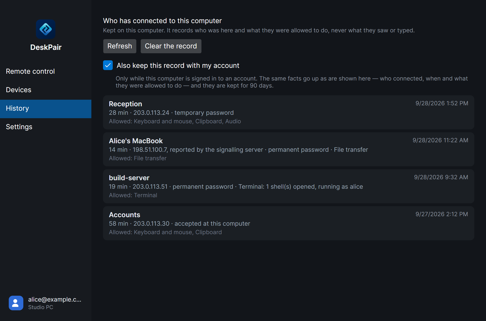
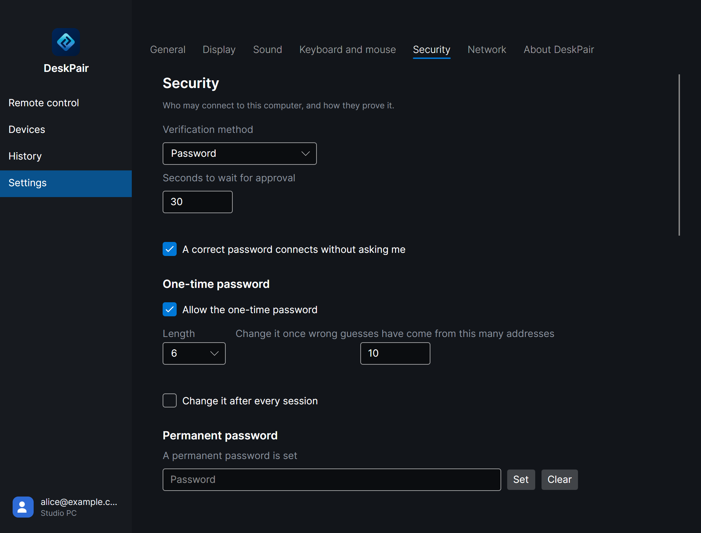

# Sunllo DeskPair

[English](../../README.md) · [繁體中文](README.zh-Hant.md) · [简体中文](README.zh-Hans.md) ·
[日本語](README.ja.md) · [한국어](README.ko.md) · [Deutsch](README.de.md) ·
[Français](README.fr.md) · [Español](README.es.md) ·
**Português (Brasil)** · [Русский](README.ru.md)

> Esta é uma tradução de [README.md](../../README.md). Se as duas divergirem, vale a versão em inglês.

Um sistema de área de trabalho remota multiplataforma (Windows / macOS / Linux) escrito em C# / .NET 10.

- **Desktop** (Avalonia) — o lado que controla e o lado controlado em um único aplicativo.
- **Celulares** (Kotlin Multiplatform, Android e iOS) — o lado que controla, no celular.
- **Rendezvous** — registro de IDs, presença e sinalização para atravessar NAT (hole punching).
- **Relay** — retransmite TCP entre aparelhos que não conseguem se conectar diretamente.

As contas são opcionais: elas ligam um computador ou um celular a uma pessoa e mantêm igual, em todos os aparelhos, a
lista de computadores salvos. São um serviço que funciona em `deskpair.app`, que os aplicativos acessam por HTTPS
(`/api/v1`); o código desse serviço não é publicado.

A arquitetura se inspira no [RustDesk](https://github.com/rustdesk/rustdesk), mas usa um protocolo próprio
(mensagens protobuf, AES-256-GCM de ponta a ponta, identidades ECDSA P-256). Veja `docs/architecture.md`; os
documentos em `docs/` são escritos em chinês tradicional.

## Capturas de tela

O aplicativo de desktop no Windows. As imagens são desenhadas a partir das próprias janelas do aplicativo por
`tools/DeskPair.Tools.Screenshots`, e os computadores, pessoas e endereços que aparecem nelas são fictícios.

<table>
  <tr>
    <td width="50%" valign="top">
      <br>
      Controlando outro computador; cada um a que você está conectado tem sua própria aba.
    </td>
    <td width="50%" valign="top">
      <br>
      Transferência de arquivos: este computador à esquerda, o outro à direita.
    </td>
  </tr>
  <tr>
    <td width="50%" valign="top">
      <br>
      O ID e a senha de uso único deste computador, e os computadores acessados recentemente.
    </td>
    <td width="50%" valign="top">
      <br>
      Dispositivos salvos em grupos, e quais estão online.
    </td>
  </tr>
  <tr>
    <td width="50%" valign="top">
      <br>
      Um shell em outro computador, rodando com a conta indicada no topo.
    </td>
    <td width="50%" valign="top">
      <br>
      Alguém pede para se conectar: a pessoa diante deste computador aceita ou recusa e escolhe o que permitir.
    </td>
  </tr>
  <tr>
    <td width="50%" valign="top">
      <br>
      Quem se conectou a este computador e o que tinha permissão para fazer.
    </td>
    <td width="50%" valign="top">
      <br>
      Configurações de segurança: quem pode se conectar e como comprova isso.
    </td>
  </tr>
</table>

## Download

Cada versão está na [página de versões](https://github.com/Sunllo/DeskPair/releases/latest) e em
[deskpair.app/download](https://deskpair.app/download), com um SHA-256 para cada arquivo (`SHA256SUMS`).

| Sistema | Arquivos |
|---|---|
| Windows 10 1809 ou mais recente | `DeskPair-<version>-win-x64.zip`, `-win-arm64.zip`, `-win-x86.zip` (32 bits). Ainda sem assinatura de código, então o SmartScreen pergunta antes da primeira execução. |
| macOS 13 ou mais recente | `DeskPair-<version>-arm64.dmg` (Apple silicon), `-x86_64.dmg` (Intel). Assinados e notarizados pela Apple. |
| Linux, glibc 2.31 ou mais recente | x64, ARM64 e ARM de 32 bits (ARMv7): para cada um, um `.deb`, um `.rpm`, um pacote do Arch e um `.tar.gz`. |

No Linux, instale o pacote da sua distribuição com as ferramentas dela (os nomes de x64 aparecem abaixo):

```
sudo apt install ./deskpair_<version>_amd64.deb                              # Debian, Ubuntu, Mint, Raspberry Pi OS
sudo dnf install ./deskpair-<version>-1.x86_64.rpm                            # Fedora, RHEL
sudo zypper install --allow-unsigned-rpm ./deskpair-<version>-1.x86_64.rpm    # openSUSE
sudo pacman -U deskpair-<version>-1-x86_64.pkg.tar.zst                        # Arch, Manjaro
```

Um pacote instala o DeskPair em `/usr/lib/deskpair`, deixa `deskpair` disponível no caminho e o coloca no menu de
aplicativos. Quando sai uma versão nova, o app avisa, e você instala o novo pacote do mesmo jeito. O `.tar.gz` roda
em qualquer distribuição, de onde for descompactado, e se atualiza sozinho, como as versões para Windows e macOS.

Os apps para celular, que controlam um computador, ainda não estão nas lojas.

## Compilação

```
dotnet build DeskPair.slnx
dotnet test DeskPair.slnx
```

Requer o SDK do .NET 10 (`global.json`). O vídeo usa o codificador do sistema operacional (Media Foundation no
Windows). Nenhum codec H.264 em software acompanha este repositório — o H.264 é patenteado independentemente do
código-fonte BSD-2 do OpenH264 —, mas você pode fornecer um; veja `native/openh264/README.md`.

## Computador controlado e aplicativo de desktop

O DeskPair é um único executável. Ao abri-lo, ele mostra seu ID e sua senha de uso único, permite conectar-se a
outros computadores e executa o motor do computador controlado no mesmo processo — ou seja, abrir o app é o que torna
este computador controlável, e fechá-lo é o que interrompe isso.

```
# o aplicativo
dotnet run --project src/DeskPair.Desktop

# só o motor, sem janela: para uma máquina sem sessão de desktop
dotnet run --project src/DeskPair.Desktop -- --server
```

**O acesso não assistido** — poder se conectar quando o computador está bloqueado ou ninguém fez login — é uma função
que você instala em Configurações › Segurança › Acessível enquanto bloqueado: um serviço no Windows, um agente do
launchd no macOS e um daemon root no Linux. Veja `docs/unattended-windows.md` e `docs/unattended-linux.md`. Sem ele,
ative Configurações › Geral › **Iniciar quando eu fizer login** para que o computador fique acessível depois de
reiniciar e fazer login.

No macOS, execute o app a partir do pacote `.app`: a permissão de gravação de tela e de acessibilidade é concedida ao
pacote, e um executável iniciado pelo terminal recebe a do terminal. Por isso, lá o `--server` serve só para testes.

Para usar seus próprios servidores, informe o servidor rendezvous e a chave pública dele em Configurações (ou em
`config.json`); conexões diretas a `host:21118` não precisam de servidor.

## Início rápido (linha de comando, sem janela)

```
# 1. servidores (padrão: rendezvous udp+tcp/21116, nat-test 21115, http 21114; relay tcp/21117)
dotnet run --project src/DeskPair.Rendezvous
dotnet run --project src/DeskPair.Relay -- --Relay:HttpPort=21124

# 2. ler a chave do servidor em que os clientes devem confiar
curl http://127.0.0.1:21114/key

# 3. computador controlado (mostra o ID de 9 dígitos e a senha temporária)
dotnet run --project tools/DeskPair.Tools.PeerCli -- host --server 127.0.0.1 --key <KEY> --password secret

# 4. lado que controla, em outro terminal; as linhas digitadas vão como chat
dotnet run --project tools/DeskPair.Tools.PeerCli -- connect <ID> --server 127.0.0.1 --key <KEY> --password secret
```

As conexões por ID tentam primeiro o endereço da rede local (mesmo IP público), depois a travessia de NAT por TCP e
por fim o relay; `--force-relay` (PeerCli) / `ForceRelay` pula os caminhos diretos. Veja `docs/nat-test-matrix.md`.

Docker: `docker compose -f deploy/docker-compose.yml up --build` (rede do host; as observações estão no arquivo).
Para rodar os servidores de verdade: `deploy/README.md`.

## Licença

O DeskPair é software livre sob a [GNU Affero General Public License, versão 3](../../LICENSE)
(`AGPL-3.0-only`), que vale igualmente para os aplicativos e os servidores deste repositório. O que importa se você
opera os servidores para outras pessoas: a seção 13 pede que você ofereça a elas o código-fonte do que realmente
está executando, incluindo suas alterações.

Componentes de terceiros mantêm suas próprias licenças; o app os lista em Configurações › Sobre o DeskPair.
